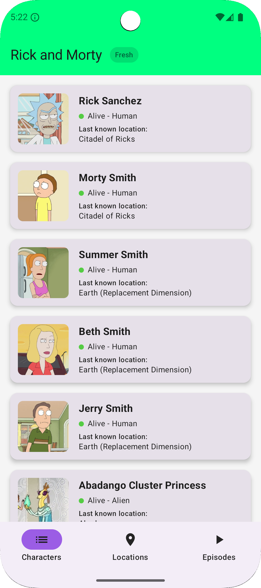
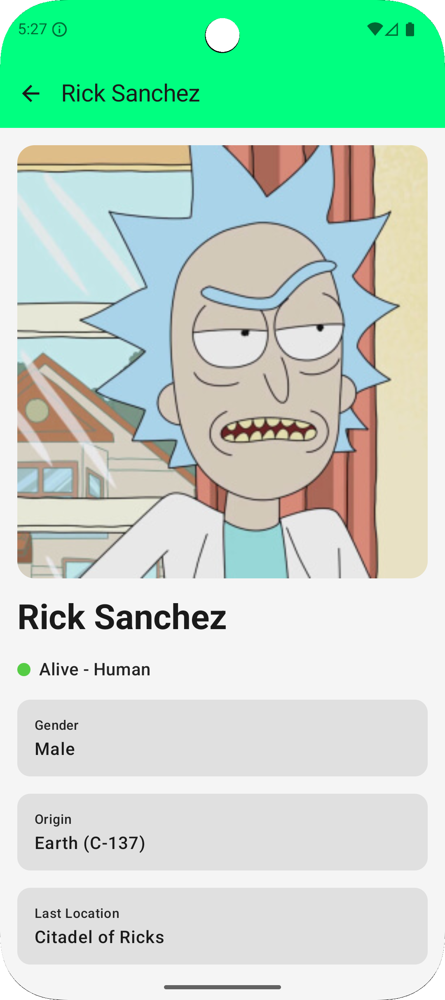
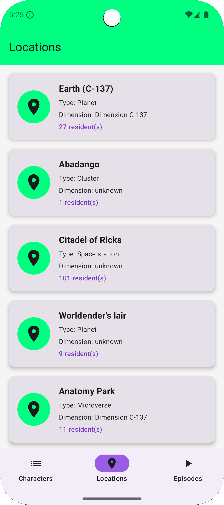
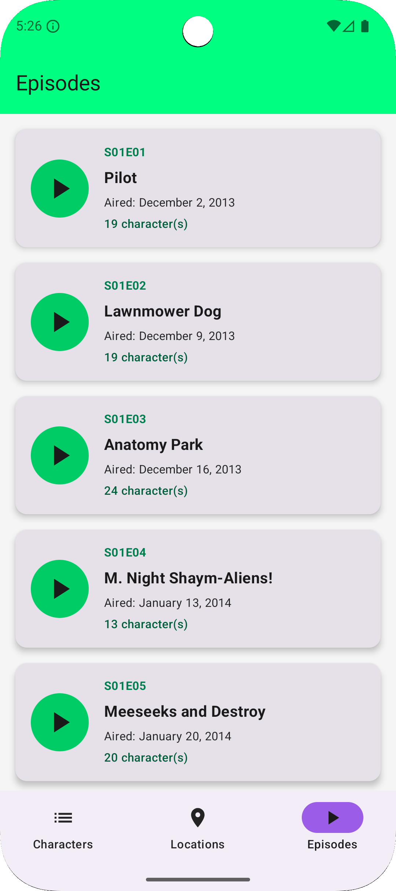

# Rick and Morty Android

Una aplicación Android moderna construida con Kotlin, Jetpack Compose y Clean Architecture que consume la [Rick and Morty API](https://rickandmortyapi.com/).

## Tabla de Contenidos

- [Características](#características)
- [Screenshots](#-screenshots)
- [Arquitectura](#arquitectura)
- [Tecnologías](#tecnologías)
- [Estructura del Proyecto](#estructura-del-proyecto)
- [Instalación](#instalación)
- [Tests](#tests)
- [Domain-Driven Design](#domain-driven-design)
- [Contribuir](#contribuir)

## Características

- ✅ **Clean Architecture** con separación en módulos
- ✅ **Domain-Driven Design (DDD)** con bounded contexts
- ✅ **Offline-First** con persistencia local en Realm
- ✅ **Cache-First Strategy** con actualización en background
- ✅ **Data Source Indicators** - muestra si los datos son de cache o API
- ✅ **Jetpack Compose** para UI moderna y declarativa
- ✅ **Material3** con soporte para tema claro/oscuro
- ✅ **Self-Validating Domain Models** que garantizan invariantes
- ✅ **Arquitectura de Excepciones Robusta** con error codes únicos
- ✅ **80+ Tests Unitarios** con nomenclatura Given-When-Then
- ✅ **Inyección de Dependencias** con Koin
- ✅ **Kotlin Coroutines** para operaciones asíncronas

## 📱 Screenshots

### Lista de Personajes
<table>
  <tr>
    <td align="center">
      
      <br />
      <sub><b>Lista con datos Fresh (API)</b></sub>
    </td>
  </tr>
</table>

### Detalle y Estados
<table>
  <tr>
    <td align="center">
      
      <br />
      <sub><b>Detalle de personaje</b></sub>
    </td>
  </tr>
</table>

### Location
<table>
  <tr>
    <td align="center">
      
      <br />
      <sub><b>Splash screen</b></sub>
    </td>
  </tr>
</table>

### Episodes
<table>
  <tr>
    <td align="center">
      
      <br />
      <sub><b>Splash screen</b></sub>
    </td>
  </tr>
</table>

## Arquitectura

El proyecto sigue los principios de **Clean Architecture** con tres módulos principales:

```
┌─────────────────────────────────────────────┐
│         Presentation Layer (:presentation)   │
│   UI, ViewModels, Compose Screens           │
└───────────────┬─────────────────────────────┘
                │
                ↓
┌─────────────────────────────────────────────┐
│         Domain Layer (:domain)              │
│   Use Cases, Entities, Business Rules       │
│   ⚠️  NO Android Dependencies               │
└───────────────┬─────────────────────────────┘
                ↑
                │
┌─────────────────────────────────────────────┐
│         Data Layer (:data)                  │
│   Repositories, API, Database, DTOs         │
└─────────────────────────────────────────────┘
```

### Principios Aplicados

- **Dependency Inversion**: Las capas externas dependen de las internas
- **Single Responsibility**: Cada módulo tiene una responsabilidad única
- **Domain Independence**: El dominio no depende de frameworks
- **Self-Validating Entities**: Los modelos garantizan sus invariantes

## Tecnologías

### Core
- **Kotlin** 2.0.21
- **Gradle** 8.13.0 con Kotlin DSL
- **Min SDK**: 24 | **Target SDK**: 36

### UI
- **Jetpack Compose** con BOM 2024.09.00
- **Material3** para componentes modernos
- **Coil** para carga de imágenes
- **Badge de origen de datos** (Fresh/Cached) en AppBar

### Data & Persistence
- **Ktor 3.0.3** - Cliente HTTP moderno
- **Realm 3.0.0** - Base de datos NoSQL local
- **Kotlinx Serialization** para JSON
- **Cache-First Strategy** con sync en background

### Architecture Components
- **ViewModel & Lifecycle**
- **Navigation Compose**
- **Koin** para inyección de dependencias

### Testing
- **JUnit 4** para tests unitarios
- **Espresso** para tests instrumentados
- **80+ tests** con cobertura completa del dominio

## Estructura del Proyecto

```
Rick and Morty Android/
│
├── presentation/              # UI Layer
│   ├── character/            # Character feature
│   │   └── list/            # Character list screen
│   ├── di/                  # Dependency injection
│   └── ui/theme/            # Material3 theme
│
├── domain/                   # Business Logic (Pure Kotlin)
│   ├── common/              # Shared domain components
│   │   └── exception/       # Base exception hierarchy
│   │       ├── DomainException.kt
│   │       ├── ValidationException.kt
│   │       ├── NotFoundException.kt
│   │       └── RepositoryException.kt
│   │
│   └── character/           # Character bounded context
│       ├── exception/       # Character-specific exceptions
│       │   └── CharacterException.kt (14 exception types)
│       ├── model/           # Self-validating domain models
│       │   ├── Character.kt
│       │   ├── CharacterLocation.kt
│       │   ├── CharacterStatus.kt
│       │   └── CharacterGender.kt
│       ├── repository/      # Repository interfaces
│       │   └── CharacterRepository.kt
│       └── usecase/         # Business use cases
│           ├── GetCharactersUseCase.kt
│           ├── GetCharacterByIdUseCase.kt
│           └── SearchCharactersByNameUseCase.kt
│
└── data/                    # Data Layer
    └── character/           # Character data implementation
        ├── repository/      # Repository implementations
        ├── remote/          # API data sources
        └── mapper/          # DTO ↔ Domain mappers
```

## Instalación

### Prerrequisitos

- Android Studio Hedgehog | 2023.1.1 o superior
- JDK 11 o superior
- Android SDK API 36

### Pasos

1. Clona el repositorio:
```bash
git clone https://github.com/yourusername/RickandMortyAndroid.git
cd RickandMortyAndroid
```

2. Abre el proyecto en Android Studio

3. Sincroniza el proyecto con Gradle:
```bash
./gradlew build
```

4. Ejecuta la aplicación:
```bash
./gradlew installDebug
```

O usa el botón "Run" en Android Studio.

## Tests

El proyecto cuenta con **80+ tests unitarios** con cobertura completa del dominio.

### Ejecutar Tests

```bash
# Todos los tests
./gradlew test

# Tests por módulo
./gradlew :domain:test
./gradlew :data:test
./gradlew :presentation:test

# Tests específicos
./gradlew test --tests "*.CharacterTest"
./gradlew test --tests "*.CharacterValidationTest"
```

### Convención de Nombres

Todos los tests siguen el patrón **Given-When-Then**:

```kotlin
@Test
fun `given valid ID when creating character then returns character successfully`() {
    val validId = 1

    val character = CharacterBuilder.rickSanchez().withId(validId).build()

    assertEquals(validId, character.id)
}
```

**Beneficios**:
- ✅ Auto-documentado: el nombre del test describe todo el escenario
- ✅ Sin comentarios innecesarios
- ✅ Fácil de leer y mantener
- ✅ Consistente en todo el proyecto

## Domain-Driven Design

### Bounded Contexts

El proyecto está organizado en contextos delimitados:

- **Character**: Gestión de personajes y sus propiedades
- **Common**: Kernel compartido con excepciones base

### Arquitectura de Excepciones

```kotlin
DomainException (base)
├── ValidationException (validaciones de entidades)
├── NotFoundException (recursos no encontrados)
├── RepositoryException (fallos de infraestructura)
│
└── CharacterException (14 tipos específicos)
    ├── InvalidCharacterId
    ├── InvalidCharacterName
    ├── InvalidCharacterImageUrl
    ├── CharacterNotFound
    ├── CharacterRepositoryUnavailable
    └── ... (9 más)
```

**Características**:
- ✅ Error codes únicos para tracking
- ✅ Mensajes orientados al negocio
- ✅ Sealed classes para exhaustividad
- ✅ Separación por responsabilidad (validación, casos de uso, repositorio)

### Self-Validating Models

Los modelos de dominio se validan a sí mismos en construcción:

```kotlin
data class Character(...) {
    init {
        validate() // Garantiza invariantes
    }

    private fun validate() {
        validateId()      // ID >= 1
        validateName()    // Name no blank
        validateImage()   // Valid HTTP/HTTPS URL
        validateUrl()     // Valid HTTP/HTTPS URL
        validateEpisodes() // At least 1 episode
        // ... más validaciones
    }
}
```

**Ventajas**:
- ✅ **Imposible crear entidades inválidas**
- ✅ Invariantes garantizados siempre
- ✅ Validación centralizada en el modelo
- ✅ Excepciones específicas y descriptivas

## Comandos Útiles

### Build

```bash
./gradlew build                  # Build completo
./gradlew assembleDebug          # APK debug
./gradlew assembleRelease        # APK release
./gradlew clean                  # Limpiar build
```

### Tests

```bash
./gradlew test                   # Todos los tests
./gradlew :domain:test          # Tests del dominio
./gradlew connectedAndroidTest   # Tests instrumentados
```

### Lint

```bash
./gradlew lint                   # Lint completo
./gradlew lintDebug             # Lint debug variant
```

## Contribuir

### Reglas de Código

1. **Clean Code**: Código auto-documentado sin comentarios - Los nombres de clases, funciones y variables deben ser descriptivos
2. **Tests**: Siempre agregar tests para nueva funcionalidad con nomenclatura `given-when-then`
3. **Validaciones**: Los modelos deben auto-validarse en construcción
4. **Excepciones**: Crear excepciones específicas con error codes únicos
5. **DDD**: Respetar los bounded contexts establecidos
6. **Arquitectura**: Mantener la separación de capas y dependencias unidireccionales

### Proceso

1. Fork el proyecto
2. Crea una rama para tu feature (`git checkout -b feature/AmazingFeature`)
3. Commit tus cambios (`git commit -m 'Add some AmazingFeature'`)
4. Push a la rama (`git push origin feature/AmazingFeature`)
5. Abre un Pull Request

## Licencia

Este proyecto es de código abierto y está disponible bajo la licencia MIT.

## Contacto

- GitHub: [@FelipeVelasquez1802](https://github.com/FelipeVelasquez1802)
- Email: felipe.diaz95@hotmail.com

## Agradecimientos

- [Rick and Morty API](https://rickandmortyapi.com/) por proporcionar los datos
- Comunidad de Android y Kotlin por las excelentes herramientas

---

**Construido con ❤️ usando Clean Architecture y DDD**